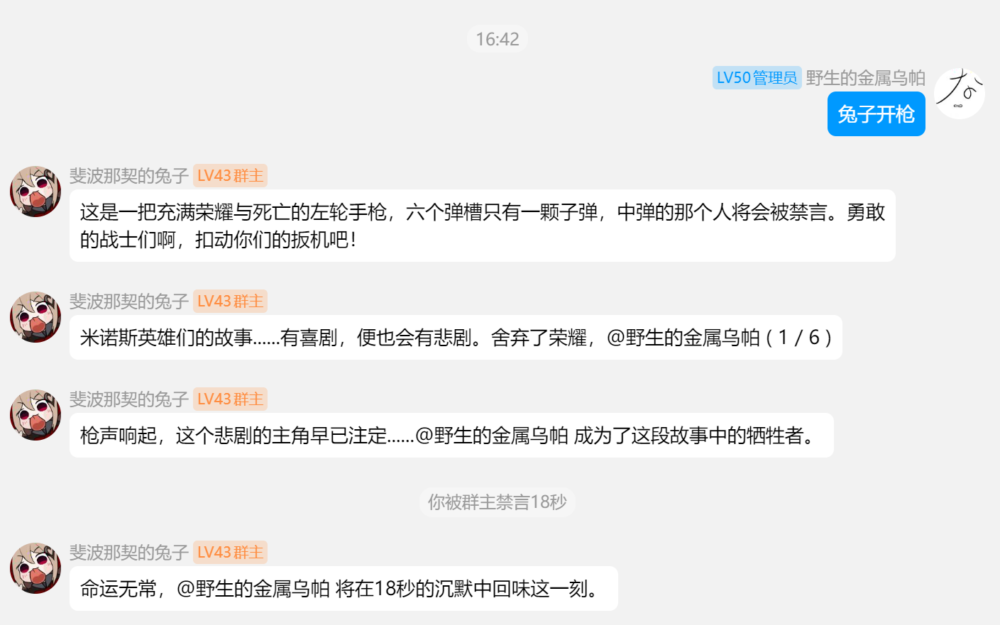

# MaiBot-Roulette-Plugin
这是为 MaiM-with-u 项目开发的俄罗斯轮盘插件，模拟真实的俄罗斯轮盘玩法，支持多种自定义设置和趣味互动。

## 插件简介
本插件适配 MaiM-with-u 最新的插件系统，能够为群聊或私聊带来刺激的俄罗斯轮盘体验。玩法简单，规则灵活，适合娱乐和活跃气氛。

## 主要功能
- 支持经典俄罗斯轮盘玩法
- 可自定义子弹数量、参与人数等参数
- 互动式消息回复，模拟真实紧张氛围
- 兼容最新 MaiM-with-u 插件系统

## 使用方法
1. 将 `russian_roulette` 文件夹放入 MaiM-with-u 的 `plugins` 目录下。
2. 重启 MaiM-with-u 。
3. 在群聊或私聊中使用指令（如 `麦麦开枪`）即可开始游戏。

## 指令说明
- `麦麦开枪`：开始一局轮盘游戏

## 注意事项
- 本插件仅供娱乐，请勿用于任何真实危险行为的模拟或鼓励。
- 若遇到兼容性问题，请关注插件仓库的最新更新。

## 鸣谢
感谢 MaiM-with-u 项目组的支持与指导。

---

如有建议或问题，欢迎提交 issue 或 PR。
